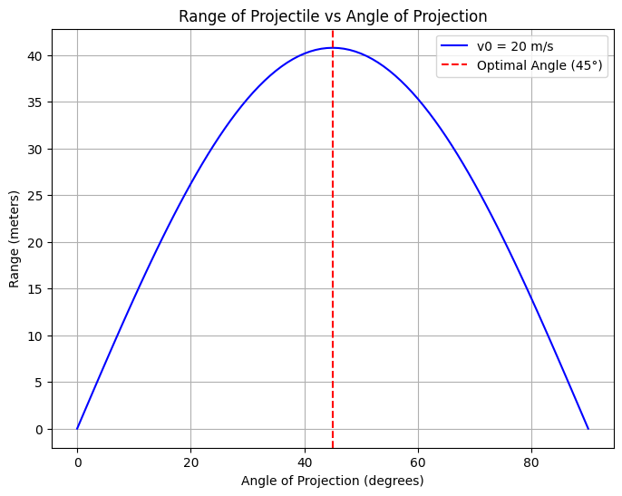
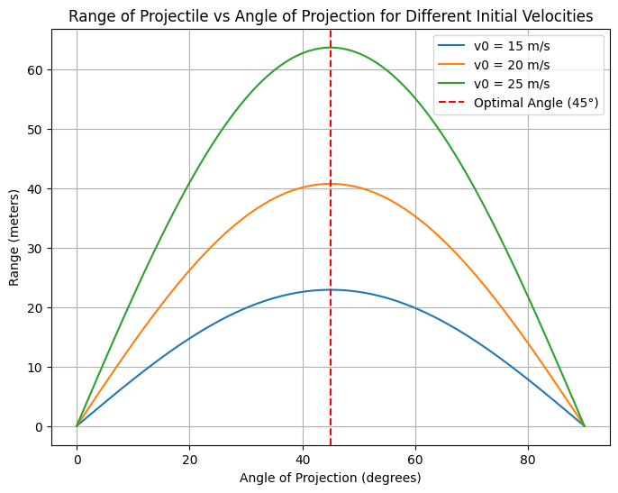

# Problem 1
### Problem 1: Investigating the Range as a Function of the Angle of Projection
 
---

## **1. Theoretical Foundation**

### **Governing Equations of Motion**
Projectile motion follows Newton’s second law and is influenced by gravity. Assuming no air resistance, the motion can be decomposed into:

- **Horizontal motion (constant velocity):**
  \[
  x(t) = v_0 \cos(\theta) t
  \]
- **Vertical motion (accelerated motion under gravity):**
  \[
  y(t) = v_0 \sin(\theta) t - \frac{1}{2} g t^2
  \]

where:
- \( v_0 \) is the initial velocity,
- \( \theta \) is the launch angle,
- \( g \) is gravitational acceleration (\(9.81 \text{ m/s}^2\) on Earth),
- \( t \) is time.

The projectile reaches the ground when \( y(t) = 0 \), solving for \( t \):

\[
t = \frac{2 v_0 \sin(\theta)}{g}
\]

Substituting this into \( x(t) \), the range \( R \) is:

\[
R = \frac{v_0^2 \sin(2\theta)}{g}
\]

### **Effects of Initial Conditions**
- The maximum range occurs at \( \theta = 45^\circ \).
- Increasing \( v_0 \) increases \( R \) quadratically.
- A larger \( g \) (e.g., on Jupiter) decreases \( R \).
- Adding an initial height \( h \) modifies the equation:

\[
R = \frac{v_0 \cos(\theta)}{g} \left(v_0 \sin(\theta) + \sqrt{(v_0 \sin(\theta))^2 + 2gh} \right)
\]

---

## **2. Analysis of the Range**
- The function \( R = f(\theta) \) follows a symmetric curve with a peak at \( 45^\circ \).
- Doubling \( v_0 \) increases \( R \) by a factor of 4.
- Gravity significantly affects the range in extraterrestrial environments.

---

## **3. Practical Applications**
- **Sports:** Predicting the trajectory of balls in soccer, basketball, etc.
- **Engineering:** Missile and projectile design.
- **Astrophysics:** Spacecraft trajectory optimization.

---

## **4. Implementation (Python Simulation)**

## **5. Limitations and Realistic Factors**
- **Air resistance**: Reduces range.
- **Wind effects**: Alters trajectory.
- **Uneven terrain**: Modifies impact position.

### **Conclusion**
This analysis provides insight into how projectile range depends on the launch angle. While an idealized model suffices for many applications, real-world conditions require numerical simulations.