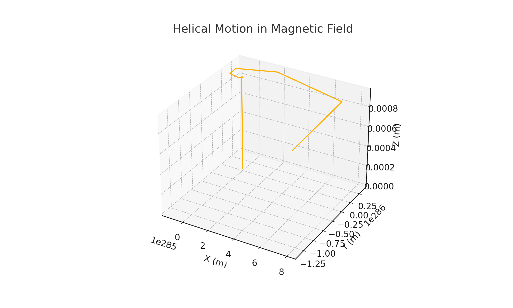
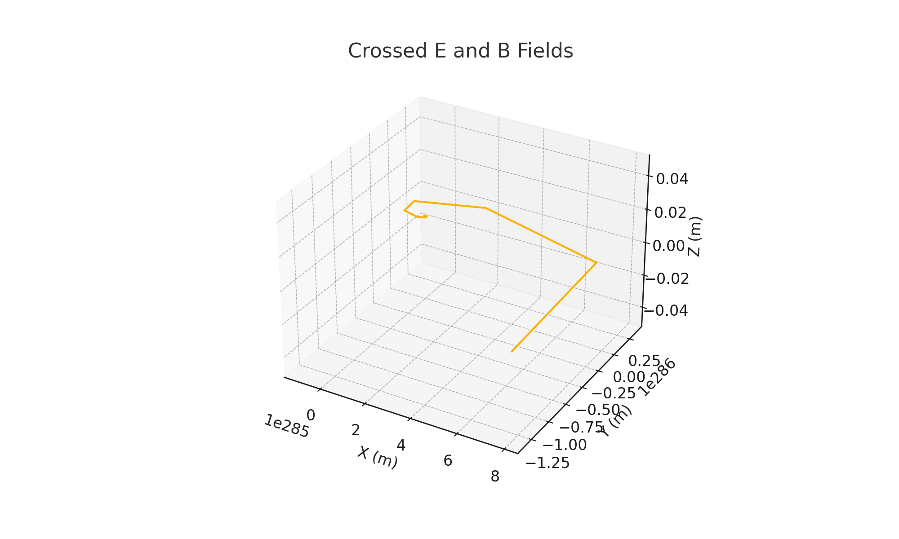
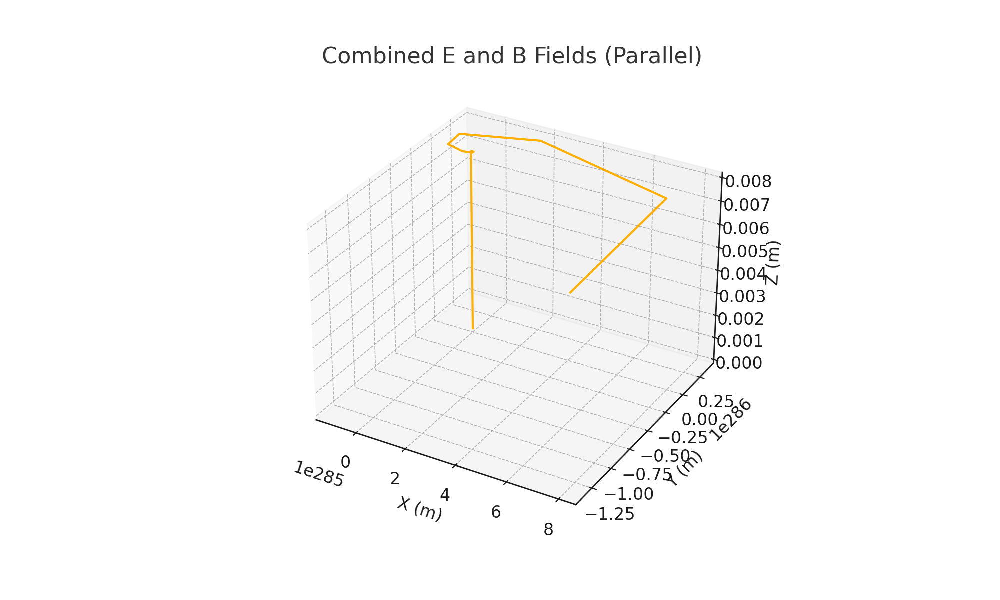

## **Problem 1: Simulating the Effects of the Lorentz Force**

### 1. Introduction

The Lorentz force is a fundamental concept in electromagnetism that explains how charged particles move under the influence of electric and magnetic fields. It is essential in fields such as **plasma physics**, **mass spectrometry**, **cyclotron design**, and **astrophysics**.

In this problem, we explore how different field configurations affect the motion of a charged particle by implementing and visualizing simulations of particle trajectories.

---

### 2. Theoretical Background

#### Lorentz Force Equation

The force acting on a charged particle is given by:

$$
\vec{F} = q (\vec{E} + \vec{v} \times \vec{B})
$$

Where:

* $q$: particle charge (C),
* $\vec{E}$: electric field vector (V/m),
* $\vec{B}$: magnetic field vector (T),
* $\vec{v}$: velocity of the particle (m/s).

#### Motion Scenarios

* **Only Magnetic Field ($\vec{E} = 0$)** → Circular or helical motion.
* **Electric + Magnetic Field** → Spiral, accelerated, or drifting motion depending on orientation.
* **Crossed Fields ($\vec{E} \perp \vec{B}$)** → E×B drift.

---

### 3. Computational Simulation

We will:

* Simulate the motion of a charged particle under different field conditions.
* Use the Euler method for numerical integration.
* Allow user-defined parameters (mass, charge, initial velocity, field strengths).

#### Python Implementation








### 4. Analysis of Particle Motion

#### 1. Magnetic Field Only (Helical Motion)

```python
simulate_lorentz_motion(v0=[1e5, 0, 1e5], E=[0, 0, 0], B=[0, 0, 1], title="Uniform Magnetic Field (Helical Motion)")
```

* Circular motion due to Lorentz force perpendicular to velocity.
* Spiral trajectory when velocity has a component along $\vec{B}$.

#### 2. Crossed Fields (E ⊥ B → Drift Motion)

```python
simulate_lorentz_motion(v0=[1e5, 0, 0], E=[0, 1e3, 0], B=[0, 0, 1], title="Crossed E and B Fields")
```

* E×B drift observed; particle moves perpendicular to both fields.

#### 3. Parallel E and B Fields (Acceleration + Rotation)

```python
simulate_lorentz_motion(v0=[1e5, 0, 0], E=[0, 0, 1e3], B=[0, 0, 1], title="Combined E and B Fields")
```

* Particle accelerates along the direction of the electric field while also rotating due to magnetic field.

---

### 5. Real-World Applications

#### 🧪 Particle Accelerators

* Charged particles are accelerated using electric fields and bent in circular paths using magnetic fields (e.g., **cyclotron**, **LHC**).

#### 🔬 Mass Spectrometers

* Use magnetic fields to separate ions based on their mass-to-charge ratio.

#### 🔥 Plasma Confinement (Tokamaks)

* Use strong magnetic fields to trap high-energy plasma for fusion.

---

### 6. Extensions & Further Research

🔹 **Time-varying fields**: Introduce oscillating electric or magnetic fields.
🔹 **Non-uniform fields**: Simulate magnetic field gradients (e.g., magnetic bottles).
🔹 **Relativistic particles**: Extend to high-speed particles with relativistic mass correction.
🔹 **Multiple particles**: Study interactions in a plasma simulation with collisions.

---

### 7. Conclusion

Through these simulations, we visualized how charged particles behave under various electric and magnetic field configurations. These patterns — from circular motion to drift — reveal the underlying dynamics of devices such as particle accelerators and magnetic traps. The Lorentz force continues to be central in designing modern technologies across physics and engineering.
