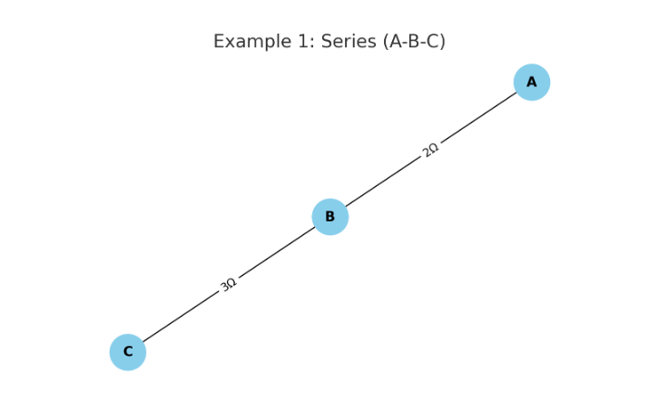
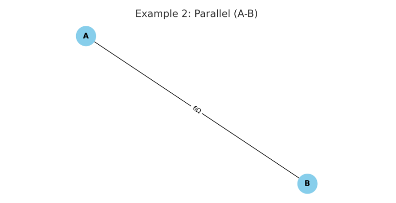
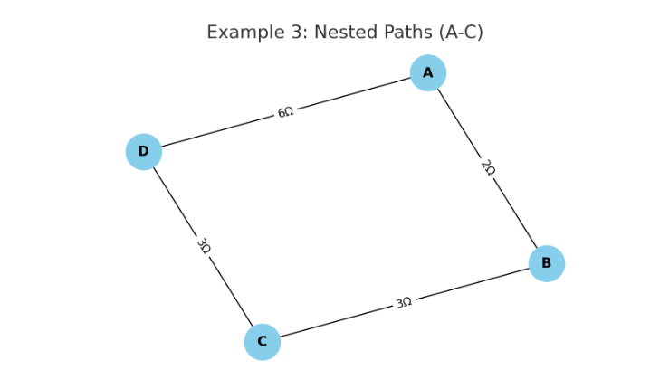

## **Problem 1: Equivalent Resistance Using Graph Theory**

### 1. Introduction

Calculating the equivalent resistance in electrical circuits is a foundational task in physics and electrical engineering. Traditional techniques rely on applying series and parallel reduction rules manually, which becomes cumbersome with complex or nested configurations.

Graph theory offers a robust alternative. By modeling a circuit as a graph—nodes as junctions and edges as resistors—we can simplify analysis using algorithms. This enables automation, optimization, and deeper understanding of how networked systems behave.

---

### 2. Theoretical Background

#### Graph Representation of Circuits

A resistor network can be modeled as an **undirected weighted graph**:

* **Vertices (nodes)** represent junction points.
* **Edges** represent resistors.
* **Weights** on edges represent resistance values in ohms (Ω).

#### Series and Parallel Simplification

* **Series:** Two resistors $R_1$ and $R_2$ between the same pair of nodes with no branching → equivalent resistance:

  $$
  R_{\text{eq}} = R_1 + R_2
  $$

* **Parallel:** Multiple resistors connecting the *same two nodes* →

  $$
  \frac{1}{R_{\text{eq}}} = \sum \frac{1}{R_i}
  $$

This approach can be applied iteratively until a single equivalent resistance remains between the source and sink nodes.

---

### 3. Python Implementation

Below is a simplified implementation using Python and NetworkX:

### 4. Example Analyses

#### Example 1: Simple Series

* Start: A, End: C
* Result: 5Ω

#### Example 2: Parallel Resistors

* Result: $\frac{1}{1/4 + 1/6} = 2.4Ω$

#### Example 3: Nested Configuration

* Requires both series and parallel simplification.
* Algorithm handles this iteratively.

---

### 6. Applications

* **Circuit simulation tools**: SPICE, LTSpice use similar graph-based simplifications.
* **Network analysis** in microchip design.
* **Robust design** in power grids, where equivalent impedance impacts performance.

---

### 7. Conclusion

We demonstrated how graph theory provides an elegant and scalable solution for calculating equivalent resistance. This method not only simplifies hand analysis but also lays the foundation for algorithmic simulations of real-world circuits, proving essential in modern electrical and computer engineering.