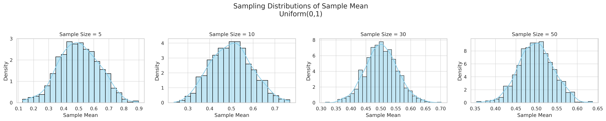
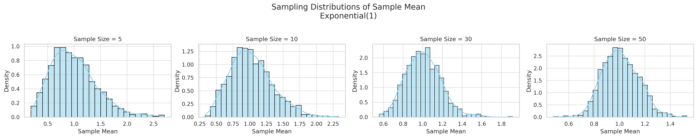
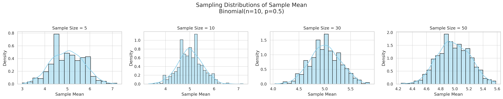

## **Problem 1: Exploring the Central Limit Theorem through Simulations**

### **Motivation**

The **Central Limit Theorem (CLT)** states that the sampling distribution of the sample mean tends toward a **normal distribution** as the sample size increases, **regardless of the original population distribution**. This theorem is a foundational concept in statistics and plays a crucial role in fields such as quality control, finance, and medical research.

### **Theory**

We test the CLT using three different types of population distributions:

* **Uniform Distribution**: All values within a range are equally likely.
* **Exponential Distribution**: Positively skewed, often used to model waiting times.
*  **Binomial Distribution**: Discrete, models the number of successes in fixed trials.

**Sampling Process:**

* Randomly draw samples of various sizes (**n = 5, 10, 30, 50**) from each population.
* Calculate the **sample mean** for each sample.
* Repeat this sampling process **1,000 times** to create the sampling distribution of the mean.

---

### **Python Simulation Overview**

We used Python with the following libraries:

* `NumPy` for generating random data
* `Matplotlib` and `Seaborn` for visualization

**Simulation Logic:**

1. Generate large population datasets for each distribution type.
2. Draw 1000 samples for each sample size (5, 10, 30, 50).
3. Plot the distribution of the sample means.
4. Observe the convergence toward a normal distribution.

---

### **Visual Results**

Here are histograms of sample means for each distribution and each sample size:

#### **1. Uniform Distribution (0, 1)**

* As the sample size increases, the distribution of sample means becomes more bell-shaped.
  
  

#### **2. Exponential Distribution (λ = 1)**

* Initially skewed, but larger samples result in near-normal distributions.
  
  

#### **3. Binomial Distribution (n=10, p=0.5)**

* Even though discrete, the sample means tend to normality with large samples.
  
  

---

### **Results & Discussion**

| Sample Size | Shape of Sampling Distribution       | Notes                    |
| ----------- | ------------------------------------ | ------------------------ |
| n = 5       | Reflects skew/symmetry of population | CLT not strongly visible |
| n = 10      | Beginning to normalize               | Some skew still present  |
| n = 30      | Mostly normal                        | CLT clearly in effect    |
| n = 50      | Nearly perfect bell-curve            | Strong evidence of CLT   |

* **CLT works** even for **non-normal populations**, but the rate of convergence depends on:

  * The **original distribution shape**
  * The **population variance**

---

### **Real-World Applications**

* **Quality Control**: Detect anomalies in manufacturing using sample means.
* **Finance**: Estimate portfolio returns and model economic indicators.
* **Medical Research**: Make inferences from clinical trial samples to general populations.

### **Conclusion**

This simulation provides a visual and intuitive understanding of the Central Limit Theorem. Key takeaways:

* **Sample size matters**: Larger samples lead to better approximations of normality.
* **Original distribution shape and variance affect convergence**.
* CLT justifies many statistical methods like **confidence intervals** and **hypothesis testing**.

**Future Exploration:**

* Try other distributions (e.g., Cauchy, Pareto).
* Analyze the role of **standard deviation** in convergence.
* Extend to **confidence interval estimations** using CLT.
