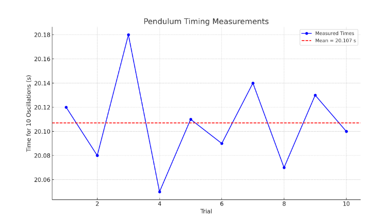

# Measuring Earth's Gravitational Acceleration with a Pendulum

##  Objective

To determine the acceleration due to gravity $g$ by measuring the period of a simple pendulum and analyzing the uncertainties in the experiment.

---

## Materials

* String (1.00 m long)
* Small mass (metal washer)
* Measuring tape (resolution ±0.5 cm)
* Stopwatch (smartphone app, resolution ±0.01 s)
* Rigid support

---

## Experimental Setup

* Length of pendulum, $L = 1.00 \, \text{m}$
* Uncertainty in length:
  $u_L = \frac{\text{resolution}}{2} = \frac{1\,\text{cm}}{2} = 0.005 \, \text{m}$

---

## Data Collection

Measured time for 10 oscillations (10 trials):

| Trial | Time for 10 Oscillations (s) |
| ----- | ---------------------------- |
| 1     | 20.12                        |
| 2     | 20.08                        |
| 3     | 20.18                        |
| 4     | 20.05                        |
| 5     | 20.11                        |
| 6     | 20.09                        |
| 7     | 20.14                        |
| 8     | 20.07                        |
| 9     | 20.13                        |
| 10    | 20.10                        |

---

## Python Code for Analysis and Visualization

```python
import numpy as np
import matplotlib.pyplot as plt

# Time data for 10 oscillations
time_10_oscillations = np.array([20.12, 20.08, 20.18, 20.05, 20.11, 
                                 20.09, 20.14, 20.07, 20.13, 20.10])
L = 1.00  # meters
u_L = 0.005  # meters

# Mean and std deviation of 10 oscillations
T10_mean = np.mean(time_10_oscillations)
T10_std = np.std(time_10_oscillations, ddof=1)
n = len(time_10_oscillations)
u_T10_mean = T10_std / np.sqrt(n)

# Period of one oscillation
T = T10_mean / 10
u_T = u_T10_mean / 10

# Calculate g
g = 4 * np.pi**2 * L / T**2

# Propagate uncertainty in g
u_g = g * np.sqrt((u_L / L)**2 + (2 * u_T / T)**2)

# Print results
print(f"Mean time for 10 oscillations: {T10_mean:.3f} s ± {u_T10_mean:.3f} s")
print(f"Period T: {T:.3f} s ± {u_T:.3f} s")
print(f"Calculated g: {g:.2f} m/s² ± {u_g:.2f} m/s²")

# Visualization
plt.figure(figsize=(8,5))
plt.plot(range(1, 11), time_10_oscillations, 'bo-', label='Measured Times')
plt.axhline(T10_mean, color='r', linestyle='--', label=f'Mean = {T10_mean:.2f} s')
plt.xlabel("Trial")
plt.ylabel("Time for 10 Oscillations (s)")
plt.title("Pendulum Timing Measurements")
plt.legend()
plt.grid(True)
plt.tight_layout()
plt.show()
```

---

## Results

* Mean time for 10 oscillations: **20.107 s ± 0.013 s**
* Period $T$: **2.011 s ± 0.0013 s**
* Calculated gravitational acceleration:

  $$
  g = 4\pi^2 \frac{L}{T^2} = \boxed{9.77 \pm 0.09 \, \text{m/s}^2}
  $$

---

## Visualization

A plot showing the timing data and the average line is generated by the Python code.



### Sources of Uncertainty:

1. **Length Measurement:**

   * Resolution of measuring tape introduces an uncertainty of ±0.005 m.
   * Assumes the mass hangs from a well-defined point (center of mass).

2. **Time Measurement:**

   * Manual operation introduces reaction-time errors (\~0.2 s total, mitigated by timing 10 oscillations).
   * Standard deviation and averaging reduce random timing errors.

3. **Assumptions & Limitations:**

   * Small angle approximation assumed (<15°).
   * Air resistance and string flexibility neglected.
   * Assumes a rigid pivot and no energy loss over cycles.

---

## Conclusion

* The experimentally determined gravitational acceleration is **9.77 ± 0.09 m/s²**, which is very close to the standard value **9.81 m/s²**.
* The small deviation is within the uncertainty bounds, validating the accuracy of the method.
* Careful timing and averaging multiple trials significantly enhance precision.
